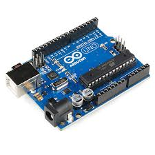
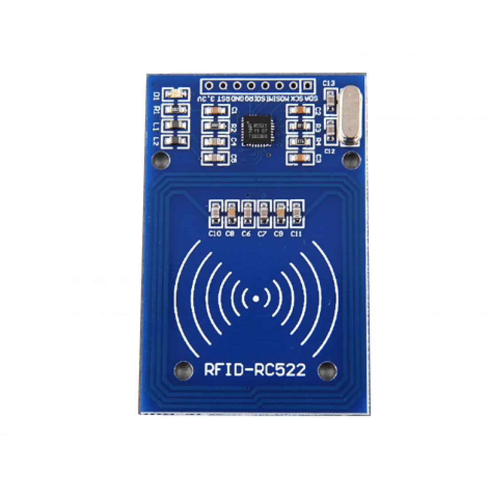
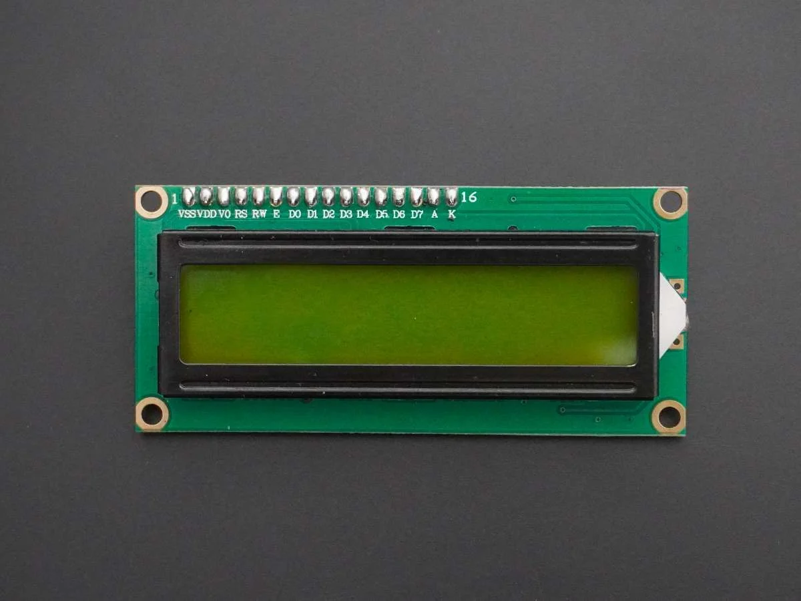
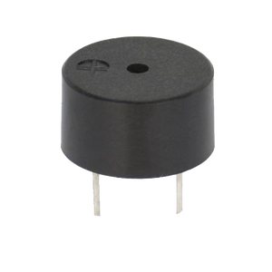
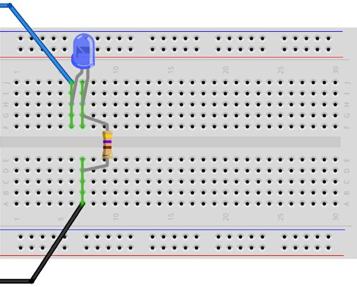
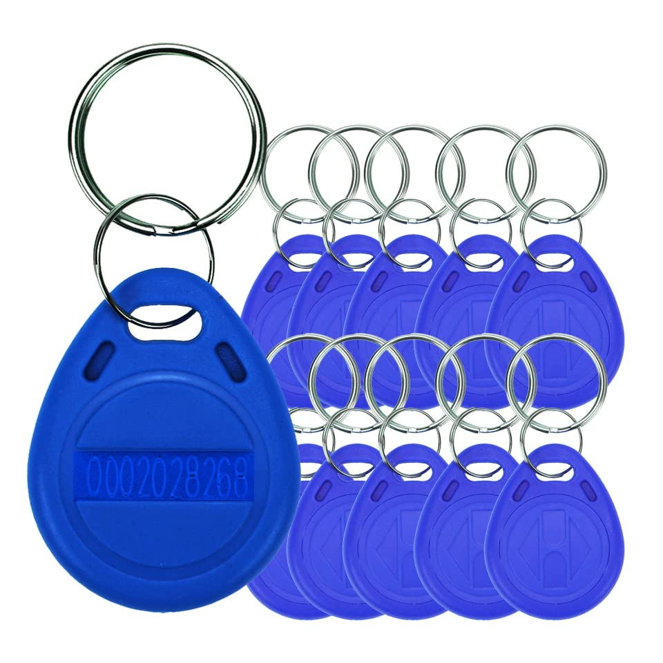
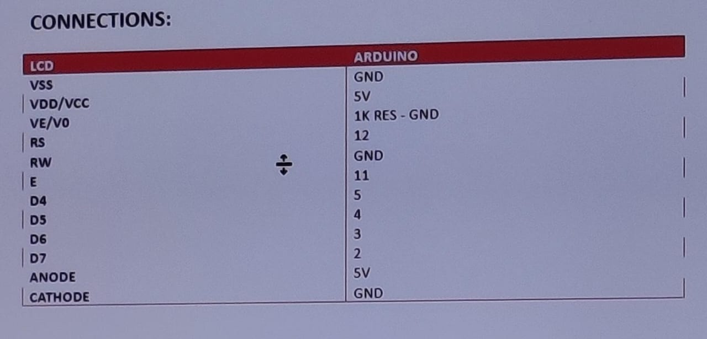
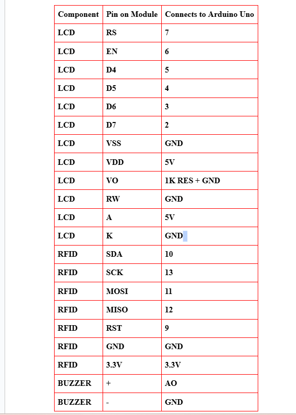
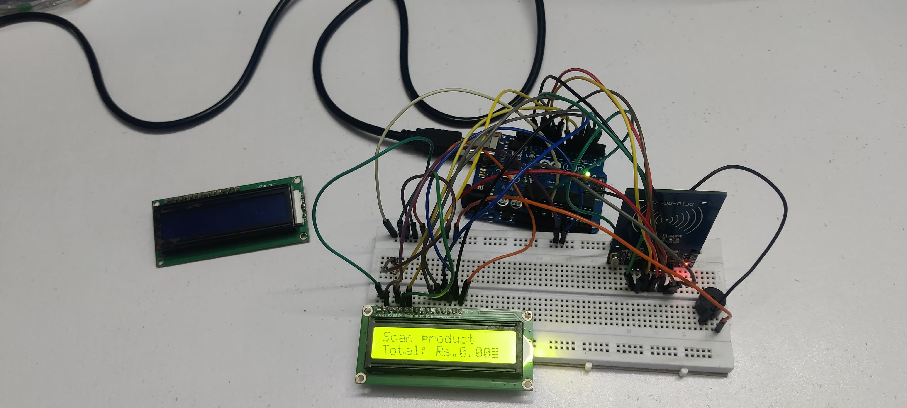

# RFID Product Scanner System

---

## Introduction

This project is a contactless IoT-based product scanner designed to simplify inventory management, checkout processes, or product tracking. Users scan RFID keys attached to products; the system then updates the total price and displays relevant information in real-time on an LCD. Scanning the same key again removes the product, updating the total accordingly. The system provides visual and audio feedback for a seamless user experience.

---

## IoT Devices Used in This Project

### 1. Arduino Uno
- **Description:** An open-source microcontroller based on ATmega328P.
- **Features:**
  - 14 digital I/O pins (6 PWM)
  - 6 analog inputs
  - USB port for programming and powering
- **Role in project:** Acts as the main controller, managing RFID reading, LCD display updates, and buzzer alerts.

---

### 2. RFID-RC522 Module
- **Description:** RFID reader/writer operating at 13.56MHz supporting ISO/MIFARE standards.
- **Features:**
  - Reads and writes data to RFID tags within approx. 5cm
  - Supports SPI, I2C, UART
- **Role in project:** Detects RFID keys, identifies products, and triggers addition or removal of items.

---

### 3. 16x2 LCD Liquid Crystal Display
- **Description:** Displays text and numerical data in two rows and sixteen columns.
- **Role in project:** Shows product names, individual prices, and the total amount dynamically.

---

### 4. Buzzer
- **Description:** Generates audio signals.
- **Role in project:** Provides pre-set sounds for successful scan, errors, or user prompts.

---

### 5. Breadboard & Connecting Wires
- **Description:** Prototyping platform for solderless connections.
- **Role in project:** Connects all components to Arduino Uno securely.

---

### 6. RFID Key Fobs
- **Description:** Small contactless tags with unique IDs.
- **Role in project:** Identify individual products. Each key includes product info like name and price internally or via a database mapping.

---

## Full Project Description

This system creates an interactive shopping or inventory environment, where RFID-keyed products can be managed with simple contactless scans.

- **Workflow:**
  - Users scan an RFID key associated with a product.
  - The Arduino reads the key’s ID via the RFID module.
  - It then checks whether this key is being scanned for the first time or again.
  - **First scan:** Adds the product’s price to the total and displays the product name and updated total on the LCD.
  - **Second scan:** Removes the product’s price from the total and updates the display accordingly.
- The system uses predefined mappings of RFID keys to product names and prices stored in the code.
- Feedback is provided visually on the LCD and audibly via the buzzer.

### Program Files:
- The **first file** simply tests the LCD by printing "Hello World".
- The **second file** is the functional project code that handles RFID detection, product updates, and display management.  

---
### Arduino Connections table:
- Turn On the LCD with "hellow world"
  

  
- Turn On the LCD with "Scan Product and total price"
  
  

### Circuit:
  

## Demonstration Videos

 
- **Video 2:** RFID reading and display update process ,Add and remove product with scanned keys  
    
     html <video src="VID_20250516_181401.mp4" controls width="600"></video> 

---

## Conclusion

This project showcases how simple IoT components like RFID, microcontrollers, and LCDs can be combined to create an efficient, contactless product management system. Such a setup can be extended for retail checkouts, inventory control, or asset tracking, demonstrating the power and flexibility of embedded IoT solutions.

---

